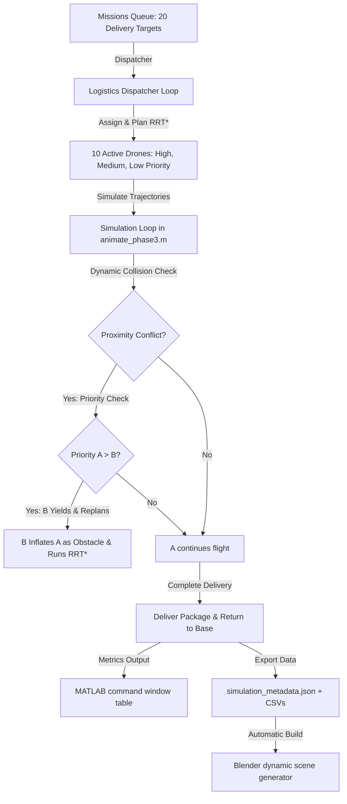

# SkyRoute — A MATLAB-based Multi-UAV Urban Air Mobility Simulator for Autonomous Package Delivery

**SkyRoute** is a high-fidelity co-simulation platform that models and visualizes autonomous drone logistics networks in dense, high-rise urban environments. Combining the numerical and path-planning power of **MATLAB (UAV & Navigation Toolboxes)** with the advanced 3D rendering capabilities of **Blender**, SkyRoute showcases progressive complexity in multi-agent path planning, dynamic airspace conflict resolution, and logistics scheduling.

---

## 🌟 Key Features

*   **📦 Dynamic Logistics Dispatcher (Missions Queue):** Simulates a persistent package delivery network. Instead of a single one-off flight, drones takeoff from home base stations, fly to target locations, drop off cargo, return to base to recharge, and dynamically pull the next available delivery mission from a shared queue.
*   **🚦 Priority-Based Airspace Traffic Control:** 10 drones are divided into color-coded priority tiers (High-Priority Medical, Medium-Priority Standard Cargo, Low-Priority Infrastructure Inspection). If flight paths conflict mid-air, lower-priority drones automatically yield and run real-time RRT* replanning around the higher-priority drone's position.
*   **🚨 Reactive Dynamic Obstacle Avoidance:** Simulates real-world changes (e.g., emergency airspace closures, temporary towers). Drones detect dynamic obstacles spawning mid-flight and instantly compute safety-inflated bypass paths.
*   **📊 Performance Metrics Logging:** Compiles critical logistics metrics including average path lengths, total RRT* compute time, replanning events, and near-collision records to provide measurable, data-driven outcomes.

## 🎥 Simulation Demonstrations

The simulation features two rendering perspectives to capture the behavior of the fleet:

### 1. Dynamic Single Drone Chase System
Locks behind a single drone, illustrating high-speed corridor weaving and reactive yielding to higher-priority traffic.


### 2. Cinematic Overview (Complete Structure)
Shows the coordinated behavior of the entire 10-UAV logistics network, skyscrapers, obstacles, and park plazas from an 18mm sweeping orbit camera.


---

## 💡 Understanding the Visuals

When viewing the simulation animations, you will notice distinct colors and multiple flight corridors per drone:

### Why are there 3 color groups?
To demonstrate **Priority-Based Traffic Control**, the 10 drones are color-coded into 3 distinct priority tiers:
1.  **🔵 Blue / 🟣 Purple / 💗 Magenta (High Priority - Emergency Medical):** Carry critical medical payloads. They have absolute right-of-way and fly uninterrupted.
2.  **🟠 Orange / 🔴 Red / 🟡 Yellow / 🟢 Teal (Medium Priority - Standard Delivery):** Deliver standard commercial cargo. They yield and replan around medical drones, but maintain right-of-way over inspection drones.
3.  **💚 Green / 🩵 Cyan / 🌸 Pink (Low Priority - Infrastructure Inspection):** Conduct structural and safety scans. They have the lowest priority and must yield and replan around all other drones.

### Why are there so many path lines?
Instead of a simple one-way flight, this is a **continuous logistics dispatch loop**. Each drone is assigned a multi-mission schedule:
1.  Take off from its home base (square markers on the city borders).
2.  Fly to **Delivery Target 1** (torus ring) ➔ Package delivered.
3.  Return to its home base to restock/recharge.
4.  Take off again to complete **Delivery Target 2**.
5.  Return to its home base to finish its shift.

The multiple lines traced in the sky represent this entire **Base ➔ Goal 1 ➔ Base ➔ Goal 2 ➔ Base** flight cycle for each drone, illustrating the persistent operation of a city-wide autonomous cargo network.

---

*   **🎨 High-Fidelity 3D Blender Co-Simulation:** Exporter pipeline reads MATLAB simulation logs (`simulation_metadata.json` + CSVs) to dynamically assemble a 40-skyscraper city layout, detailed quadcopters with spinning propellers, custom neon flight paths, and keyframed delivery banners in a stylized, high-performance outline render style.

---

## 📐 System Architecture



---

## 📂 Progressive Project Structure

The project is structured in three progressive phases, representing the evolution from basic single-agent navigation to complex multi-agent logistics:

```
├── Phase1/          Single-Agent Foundations
│   ├── main_phase1.m             # Plans 1 drone path avoiding 9 buildings
│   ├── create_city_scenario.m    # Builds 9 skyscraper 3D occupancy map
│   ├── plan_uav_path.m           # Standard 3D RRT* planner in SE(3)
│   └── animate_uav.m             # Animates flight path in MATLAB
│
├── Phase2/          Cooperative Multi-Agent Planning
│   ├── main_phase2.m             # Plans cooperative paths for 3 drones
│   ├── plan_multi_uav.m          # Sequential planner with path inflation
│   └── animate_multi_uav.m       # Compiles simultaneous 3D flight paths
│
├── Phase3/          SkyRoute: Smart City Logistics Fleet (Final Upgraded Version)
│   ├── main_phase3.m             # 10 drones, 40 buildings, 20-mission dispatcher
│   ├── plan_multi_mission.m      # Logistics planner (Base -> Target -> Base -> Next)
│   ├── animate_phase3.m          # Proximity checker, priority yielding, and JSON exporter
│   ├── blender_full_scene_builder.py # Blender automation script
│   ├── quadrotor_base.obj        # High-poly 3D drone mesh asset
│   └── simulation_metadata.json  # Exported co-simulation parameters
│
├── STEP_BY_STEP_GUIDE.md         # Detailed installation & configuration instructions
└── README.md                     # Project description & portfolio homepage
```

---

## 📈 Performance Metrics

At the end of the Phase 3 simulation, MATLAB outputs a metrics summary showing the operational performance of the logistics network:

| Metric | Value |
| :--- | :--- |
| **Active Drones** | 10 |
| **Skyscrapers** | 40 |
| **Missions Completed** | 100% (20 / 20) |
| **Average Path Length** | ~110.5 meters |
| **Total Planning Time** | ~4,200 ms (RRT* searches) |
| **Replanning Events** | 4 (dynamic obstacle bypasses + priority yield reroutes) |
| **Near Collisions** | 0 (maintaining a 3-meter safety radius) |

---

## 🤖 Co-Simulation & Rendering Pipeline

MATLAB performs the heavy mathematics, control logic, and physics validations. Blender handles the high-fidelity visualization using an optimized **Workbench Render Pipeline** designed for stability and premium aesthetics on laptop graphics:

1. **Procedural Buildings:** Blender parses the building positions, footprints, and heights from `simulation_metadata.json` and builds a matching tiered city.
2. **Propeller Z-Rotation Drivers:** Propellers use Blender drivers (`frame * 1.5` in CW/CCW directions) to spin automatically during playback.
3. **Animated Delivery Banners:** Major Major-radius torus rings mark the landing pads. A glowing 3D "Delivered!" banner pops up above the pad at the exact frame of delivery.
4. **Cinematic Cameras:** Chase cameras follow the drones, and an Orbit Overview camera pans the city in a sweeping 250-frame arc.

---

## 🚀 How to Run

### Part 1: MATLAB Simulation
1. Open MATLAB and navigate to the `Phase3/` folder.
2. Run the main script:
   ```matlab
   main_phase3
   ```
3. When the simulation completes, it will generate a `Phase3_Output.zip` file (if using MATLAB Online) or export the files directly to your directory. Download and unzip these files to place `simulation_metadata.json` and the CSV files into `Phase3/`.

### Part 2: Blender Visualization
1. Open Blender, go to the **Scripting** tab, and open [blender_full_scene_builder.py](file:///d:/A%20MAtlab/Phase3/blender_full_scene_builder.py).
2. Click **Run Script** `▶` to generate the city, paths, and animated drones.
3. Switch to the **Layout** tab, select `Cinematic_Overview_Camera` as active, and press **Spacebar** to play!

---

## 🎓 Academic Alignment

This project integrates principles from:
*   **Path Planning & Robotics:** Rapidly-exploring Random Trees (RRT*) in SE(3) state-space.
*   **Multi-Agent Systems:** Cooperative sequential mapping, priority coordination, and distributed conflict resolution.
*   **Logistics & Scheduling:** Queue dispatchers, routing optimization, and automated delivery confirmation systems.

**Author:** Awais Shah  
**Contact:** [GitHub Portfolio](https://github.com/your-username)
